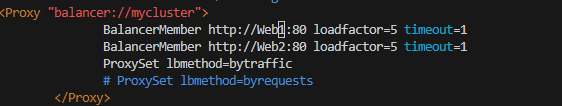

# PROJECT 8 : CONFIGURE APACHE AS A LOAD BALANCER

1. Create an Ubuntu Server 20.04 EC2 instance and name it Project-8-apache-lb

2. Open TCP port 80 on Project-8-apache-lb by creating an Inbound Rule in Security Group

3. Install Apache Load Balancer on Project-8-apache-lb server and configure it to point traffic coming to LB to both Web Servers

#Install apache2

`sudo apt update`

`sudo apt install apache2 -y`

`sudo apt-get install libxml2-dev`

#Enable following modules

`sudo a2enmod rewrite`

`sudo a2enmod proxy`

`sudo a2enmod proxy_balancer`

`sudo a2enmod proxy_http`

`sudo a2enmod headers`

`sudo a2enmod lbmethod_bytraffic`

#Restart apache2 service

`sudo systemctl restart apache2`

`sudo systemctl status apache2`

Configure load balancing

`sudo vi /etc/apache2/sites-available/000-default.conf`

#Add this configuration into this section <VirtualHost *:80>  </VirtualHost>

    <Proxy "balancer://mycluster">
               BalancerMember http://<WebServer1-Private-IP-Address>:80 loadfactor= timeout=1
               BalancerMember http://<WebServer2-Private-IP-Address>:80 loadfactor=5 timeout=1
               ProxySet lbmethod=bytraffic
               # ProxySet lbmethod=byrequests
        </Proxy>

        ProxyPreserveHost On
        ProxyPass / balancer://mycluster/
        ProxyPassReverse / balancer://mycluster/

#Restart apache server

`sudo systemctl restart apache2`

Verify that our configuration works – try to access your LB’s public IP address or Public DNS name from your browser

    http://<Load-Balancer-Public-IP-Address-or-Public-DNS-Name>/index.php

If in the Project-7 you mounted /var/log/httpd/ from your Web Servers to the NFS server – unmount them and make sure that each Web Server has its own log directory.

`sudo tail -f /var/log/httpd/access_log`

Try to refresh your browser page several times and make sure that both servers receive HTTP GET requests from your LB

     http://<Load-Balancer-Public-IP-Address-or-Public-DNS-Name>/index.php 

4.  Optional Step – Configure Local DNS Names Resolution

#Open this file on your LB server

sudo vi /etc/hosts

#Add 2 records into this file with Local IP address and arbitrary name for both of your Web Servers

     <WebServer1-Private-IP-Address> Web1

     <WebServer2-Private-IP-Address> Web2

5. Now you can update your LB config file with those names instead of IP addresses

        BalancerMember http://Web1:80 loadfactor=5 timeout=1
        BalancerMember http://Web2:80 loadfactor=5 timeout=1

You can try to curl your Web Servers from LB locally curl http://Web1 or curl http://Web2 – it shall work.

Remember, this is only internal configuration and it is also local to your LB server, these names will neither be ‘resolvable’ from other servers internally nor from the Internet.